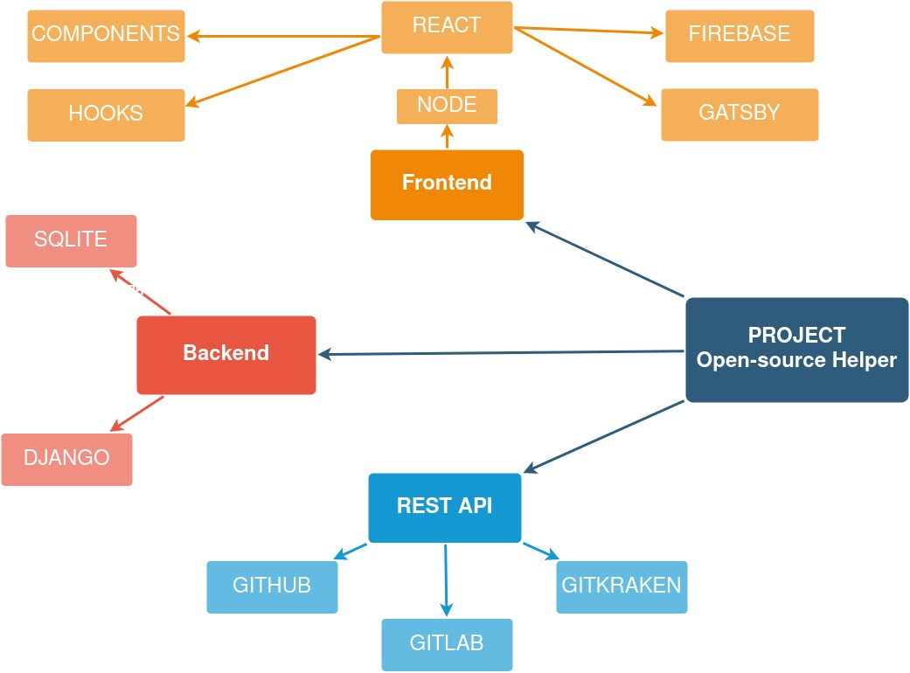

# OPEN SOURCE HELPER

## INTRODUCTION

In today's world, the open-source contribution is one of the most noticeable skills that is expected from every developer. Open source projects are a great way of developing quality products by working together with other developers. You create code that benefits the community. That feature you need so much in your project, fork the repository and add the code yourself to enable it.

Keeping the above point in mind, our team has developed "The Open-source helper" which is a Web Application that suggests/recommends ongoing active open-source projects and repositories based on the interest and user requirement. It is built for the student who wants to start out as developers.  

This Application allows the user to find a relevant project from which he/she can learn and contribute, just by searching a skill or keyword based on the user's interest

## EXISTING WORK WITH LIMITATIONS

Currently, existing open-source are limited to only their websites. User has to visit different websites to see various existing open-source projects. so the user remains unaware of many ongoing projects. Like if the user is using GitHub he will only be able to see the projects available in GitHub.

Hence, the options available in existing websites are very limited.

## Proposed Work & Methodology

* Searching, Organizing, Ranking with relevance to skills among all the Open Source Projects available on all major software development hosting websites.

* Compare all projects and technology used, from hundreds of projects on hosting sites. Save time and resources on finding your ideal project choice with thousands of reviews, forks and stars.  

**What our project aims to perform.**

We will be providing a user-friendly website for users to Interact with thousands of open source projects available on the web, allowing them to select their ideal match with all filters to contribute on. 

## Flow Chart of the Project

## NOVELTY OF THE PROJECT       

* Our website adds various new features which will enhance the user’s experience.
* One of which is, it provides the user with a pool of open source projects from a various website like GitHub, GitLab etc at one place.
* It also asks the user for the technology of their interest and lists out various repositories by searching the keyword mentioned in which they can contribute and learn.

## REFERENCES TO EXISTING WORK

* GITHUB
* GITLAB 
* SOURCEFORGE
* GITKRAKEN
* APACHE ALLURA
* CLOUD SOURCE REPOSITORIES
  * These all references only searches for the repositories in their database only. 

## REAL TIME USAGE

Our website will provide the user to Search efficiently, Select Relevently, & Contribute effectively to live Real-time Open source projects. It provides search result in real time. The result includes the project and repositories on which developers from all around the globe are currently working on.
Contributing to Open-Source projects is as important as developing one’s own project, collaborating your work & learning with orders.

## HARDWARE & SOFTWARE REQUIREMENTS 

*The project involved the implementation of the following technologies:-  
*
**Language:**

* HTML
* CSS
* JS
* Python

**Framework:**

* REACT
* DJANGO

**Tools:**
    
* Node Js
* Firebase / SQLite
* Gatsby
* Postman

## OVERALL SYSTEM ARCHITECTURE DIAGRAM

